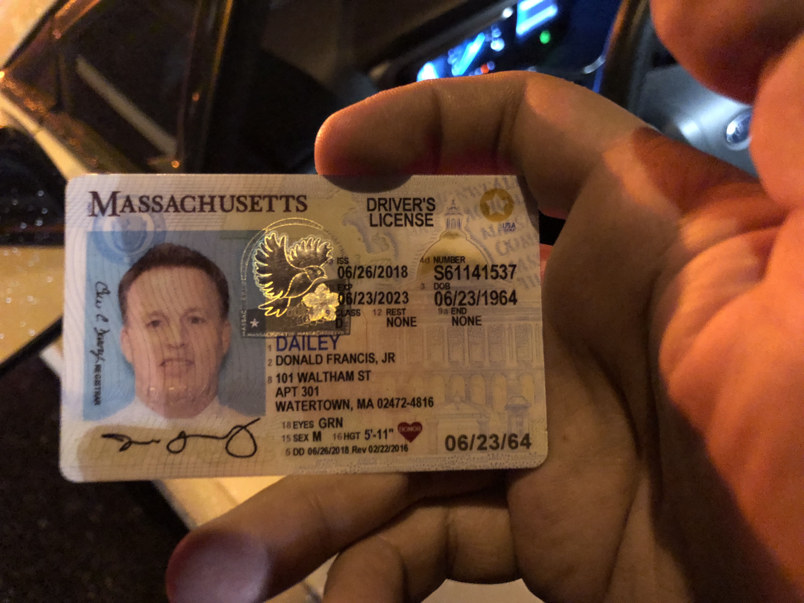

# Presentment Claim

Donald Francis Dailey Jr (Massachusetts Driver’s license Number S61141537[^Donald Francis Dailey Jr's driver's license]) drove a Massachusetts State Vehicle (plate number C869) and hit my car rear-end while my car was totally still within the lane. This accident happened at 6:24pm on Wednesday 11/20/2019 in Millbury. To be more specific, it happened on the ramp of I-90 highway, where the coordinate is $$42^\circ$$ $$12'$$ $$31.302''$$ $$N$$, $$71^\circ$$ $$47'$$ $$0.408''$$ $$W$$.

Donald Francis Dailey Jr committed responsible for this rear-end accident right after he hit my car. He committed his responsibility again in a text message[^text_message] and also apologized. The  accident scene is shown in evidence 1[^evidence 1]. The car with flashing signal light in front of the white car which caused the accident is my car.

My loss is that a circular part of my back bumper is missing[^evidence 2]. Other damages may be found in future check. I reserve my right to fix the damages that are unknown now but were caused by this accident with the reimbursement of the Commonwealth of Massachusetts.

I took a video at the accident scene, which shows clearly and undoubtly that Donald Francis Dailey Jr was completely responsible for this accident. (See attached file *evidence_3.mp4*)[^video]

I hereby request that the Commonwealth of Massachusetts reimburses all cost caused by this accident.

Chengwei Ye

November 26th, 2019

[^Donald Francis Dailey Jr's driver's license]: Donald Francis Dailey Jr's driver's license 
[^text_message]: Donald Francis Dailey Jr committed responsible and apologized for this accident 
[^evidence 1]: Accident scene 
[^evidence 2]: A circular part of my back bumper is missing.
[^video]:Please see attached file [*evidence_3.mp4*](./evidence_3.mp4)
