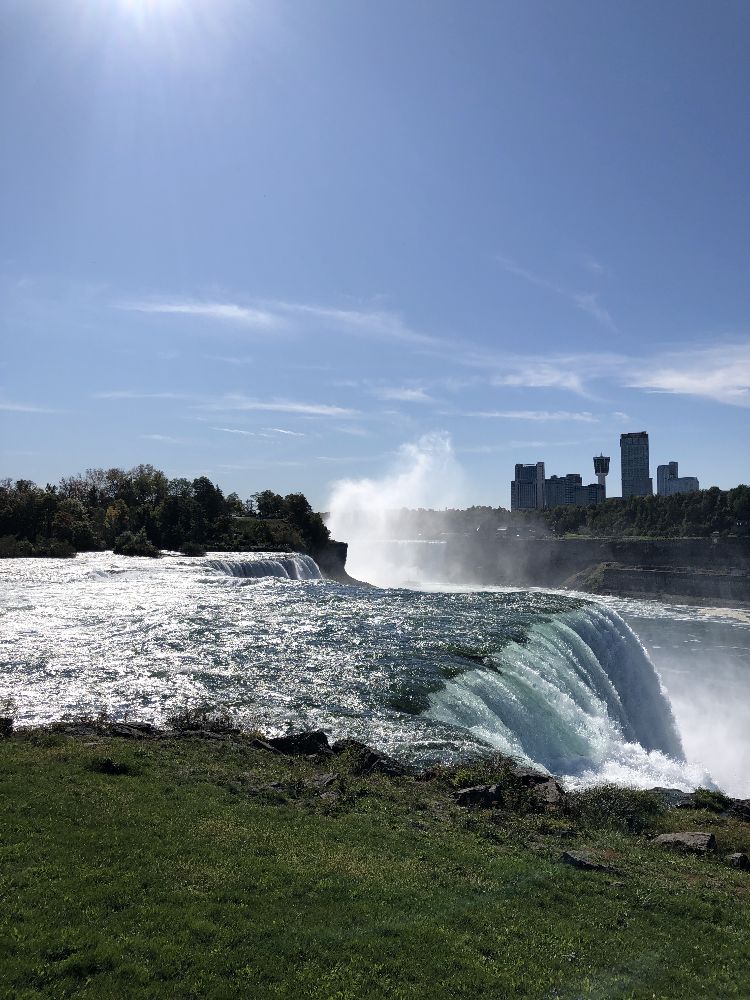
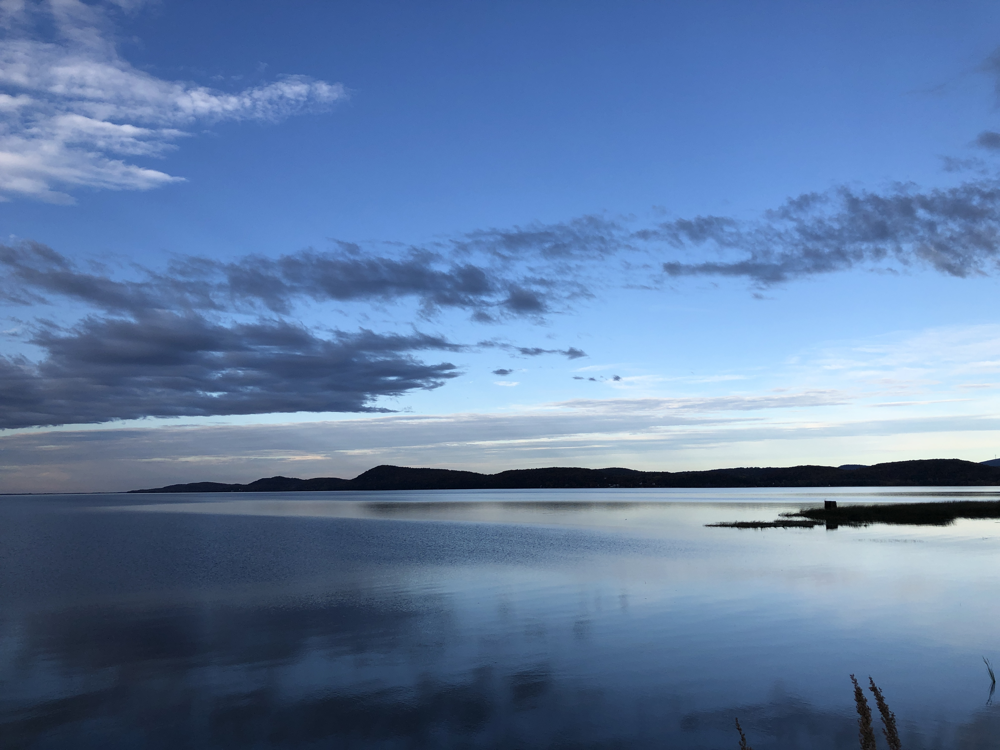

# 2019 Fall Break

秋假总共有十天，正值新英格兰秋天红叶季。北边的Vermont，Maine和New Hampshire都是赏枫叶的好去处。Maine有点远，而且暑假刚去过Acadia，就不打算去了。New Hampshire的白山(White Mountain)有很多hiking的trial，早就打算去一次，所以列入了目的地。Vermont是一个不太有存在感的州，但是据说景色很不错，所以也想去。本来没有列入计划的是Niagara大瀑布。这个瀑布在纽约州，在美加边境上，开车单程七小时。想去是因为一直想去这个著名景点，但是没有时间。这次如果不去的话，入了冬就去不了了。

仔细盘算了一下时间，发现可以都去，只是路上时间有点长，但是开车也是一件好玩的事情，所以就决定这么上路了。

看起来就是画了一个梯形，其实路上来来回回还折返了好多路，最多的一天开了11个小时的车。总共开了1792mile，约合2900公里，加了220块的油，交了32块钱的过路费（有点爽）。

这次旅游参加表演的演员有🐔，🐑，蜻蜓和我。

## Thursday 10/10/2019

今天的目的地是Niagara大瀑布。下午🐑有考试，只能等他结束之后走。不等到明天再走是因为我们打算后天就离开瀑布去Vermont。如果明天再走的话，路上再开七个小时的车就没时间看瀑布了。

下午六点把东西装上车，加满油，出发！

一个小时后在Springfield的蓝象餐厅吃了泰国菜，这是黄鸡提前一天找好的“难得一见的4.5分评分的泰国菜”，反正跟着黄鸡吃总是不会有问题。吃完继续上路。

看到这种还可以在这条路上开67mile，再开6个小时才到，心里就很愉快，可能小时候想开公交车不是没有道理的。

I90往西边开就变成了两车道，但是晚上车很少。一路听着黄鸡和🐑讨论性服务为什么是非法的🤣，很快一箱油就见底了。进服务区加油，上厕所，然后换小蜻蜓开车。

两点左右，终于开到了住的地方。这是一个紧邻大瀑布的城市，住的地方离瀑布只要十分钟左右。

## Friday 10/11

中午出门去吃了一碗越南Pho，也是黄鸡找的，还不错。

吃完饭就开车到大瀑布，绕了三圈之后终于找到了停车的地方。感觉美国这边房子、停车和吃的都比较有限，过了河就有很。而且加拿大那边瀑布是正对着的，更好看，下次有机会直接开车到对面去看看。

因为不能到加拿大那边看正面，我们就坐船到邻近瀑布的地方去。走在路上发现旁边就是瀑布上面的河，流着流着就不见了，再往前走就看到瀑布。这个角度看是一种不一样的感觉。

这座桥叫rainbow bridge，桥中间是美加边境，左边是加拿大国旗，右边是美国国旗。

靠近瀑布的地方全是水雾，游客都是穿着雨衣站在船上。因为有水雾，彩虹太好看了。

这才是真彩虹桥。

瀑布有两个，一个是近处这个，比较小。远的那个是马蹄形的，比较大。这是从美国这边看能看到的最大角度了。

坐完船，我们绕到一个没什么人的地方放无人机，飞到近处看了一眼瀑布，应该已经飞进加拿大了。无人机拍的效果太好了。

旁边的巴基斯坦路人照的合影，眼睛都睁不开。

在这个角度看到的是瀑布的侧面。

水中间还站着两只疑似鸭子，也不怕被冲跑。

黄鸡想搞这只黑松鼠。

看瀑布看到太阳快要落山，黄鸡找了一家附近的印度自助餐，想尝试一下老印度。有个咖喱羊还蛮好吃的，其他的就不怎么样。吃了一整顿水果和咖喱羊哈哈哈哈哈。

## Saturday 10/12

今天是计划开车时间最长的一天，要从大瀑布开回快到麻州的地方，然后向北再开到美加边境，再折头开回纽约州住。

Vermont主要就是沿路景色比较好看，所以今天是沿着著名观景路线开，预计在天黑前开到最北边。

[![北上路线 https://www.google.com/maps/dir/Niagara+Falls,+NY/Chimney+Point+State+Park,+Vermont+17,+Addison,+VT/Burlington,+VT/Alburgh,+VT/@43.7758528,-76.6016759,7.07z/data=!4m31!4m30!1m5!1m1!1s0x89d363ea29e633b7:0x61975ae4b9c5aab3!2m2!1d-79.0377388!2d43.0962143!1m5!1m1!1s0x4ccaa17b2838c205:0xd79e0008cc099be7!2m2!1d-73.4191557!2d44.035573!1m10!1m1!1s0x4cca7a55b69b55e5:0xc35fe519720e498e!2m2!1d-73.212072!2d44.4758825!3m4!1m2!1d-73.3113456!2d44.6868057!3s0x4cca153bb4203ced:0xad7fdd5d3de9cbf3!1m5!1m1!1s0x4cca211bf5ec19fd:0x3318bb46776c5cb0!2m2!1d-73.3002239!2d44.9750541!3e0](./10.12route.png)](https://www.google.com/maps/dir/Niagara+Falls,+NY/Chimney+Point+State+Park,+Vermont+17,+Addison,+VT/Burlington,+VT/Alburgh,+VT/@43.7758528,-76.6016759,7.07z/data=!4m31!4m30!1m5!1m1!1s0x89d363ea29e633b7:0x61975ae4b9c5aab3!2m2!1d-79.0377388!2d43.0962143!1m5!1m1!1s0x4ccaa17b2838c205:0xd79e0008cc099be7!2m2!1d-73.4191557!2d44.035573!1m10!1m1!1s0x4cca7a55b69b55e5:0xc35fe519720e498e!2m2!1d-73.212072!2d44.4758825!3m4!1m2!1d-73.3113456!2d44.6868057!3s0x4cca153bb4203ced:0xad7fdd5d3de9cbf3!1m5!1m1!1s0x4cca211bf5ec19fd:0x3318bb46776c5cb0!2m2!1d-73.3002239!2d44.9750541!3e0)

这是[往北边开的路线](https://www.google.com/maps/dir/Niagara+Falls,+NY/Chimney+Point+State+Park,+Vermont+17,+Addison,+VT/Burlington,+VT/Alburgh,+VT/@43.7758528,-76.6016759,7.07z/data=!4m31!4m30!1m5!1m1!1s0x89d363ea29e633b7:0x61975ae4b9c5aab3!2m2!1d-79.0377388!2d43.0962143!1m5!1m1!1s0x4ccaa17b2838c205:0xd79e0008cc099be7!2m2!1d-73.4191557!2d44.035573!1m10!1m1!1s0x4cca7a55b69b55e5:0xc35fe519720e498e!2m2!1d-73.212072!2d44.4758825!3m4!1m2!1d-73.3113456!2d44.6868057!3s0x4cca153bb4203ced:0xad7fdd5d3de9cbf3!1m5!1m1!1s0x4cca211bf5ec19fd:0x3318bb46776c5cb0!2m2!1d-73.3002239!2d44.9750541!3e0)，全程八小时，沿途有几个泰迪熊和巧克力的工厂店可以停下来玩，所以打算六点出门（实际是七点出的门，正好到的时候天黑）。

开到最北边之后再到Burlington吃晚饭，然后到纽约州的某处住宿（因为Vermont境内实在是找不到合适的住处）。

前半段一路都是高速，可以睡觉。后来进了一片森林里的小路，就经常可以见到想停下来的小路。后来就找了一条小路开进去，见到一个正在车旁边装猎枪的人，他看到我们吓了一跳，我们也吓了一跳，离他远远的才停下来。这是一条林间小道，两边都是树。就在这里放无人机到天上去拍照。

随便找了个岔路拐下去就见到一个湖，景色都很不错。

纽约州和Vermont的边界在Lake Champlain中间，开在桥上就听到导航说Welcome to Vermont。路边有好多租滑雪工具的，估计是冬天滑雪的好去处。也有好多卖农产品的Farm，找了一家进去逛逛。

🐔蜻蜓和🐑买了一些蜂蜜，我买了一袋香肠和几张明信片。还买了几个椭圆形的番茄现场吃。

继续上路，看到远处有一片红叶很好看，就赶紧停车下来看。没想到只开出去几十秒的路，就看不到刚才那一片了。所以又派无人机去侦察了一下。

这是在地上拍的。

下一次停车就是泰迪熊的工厂店。不知道为什么店里的熊都丑的不行，难道是以前看到的好看的呢都是假的？😂

门口的大熊还不错。

继续上路，路上的风景都比这个好看。

到Burlington附近还去了一个巧克力的工厂店，但是已经过了试吃活动的时间，就没吃到。我对巧克力本来也兴趣不大，主要是看看各种形状的巧克力。

这个时候已经五点多，六点半左右天就要黑了，所以就继续往北开。剩下这段路还有半个小时左右，是在Lake Champlain里穿行，想在天黑之前走完。

虽然想快点走，但是还是忍不住停了五分钟。

最后在天快要黑的时候到了北边的国界。在湖边有一栋房子，里面住着个老爷爷，跟我们说他女儿在Becker College上学（Becker College就是我们家门口的一个学校，好巧啊），还指着远处的一座桥说，这里是北纬45度，过了这个桥就是加拿大。

在湖边玩打水漂。

天完全黑了以后开车回Burlington觅食。白天到的时候感觉没什么人，没想到晚上吃饭的地方爆满，有点像小吃一条街的感觉，到处排队，找车位都找了好久。进了好几家pizza店都要等一个多小时，最后就决定吃一家人稍微少一点的日本拉面（太饿了没有图）。等的时候正好把下午买的香肠拿出来啃了（因为买了才发现是要放冰箱的，怕坏了）。

查攻略的时候我发现Burlington不是Vermont的首府，后来讨论的时候黄鸡说是首府，我就跟他打赌，赌一顿日式自助，价值$30。他找到真正的首府之后捶胸顿足，大呼这是什么破地方，就这么一个主要城市还不是首府，首府是一个只有8000人的小镇子，华人比例0.01%，相当于只有0.8个，哈哈哈哈哈哈哈哈。

吃完之后又去打包了一个pizza当第二天早上的早餐。才端出来就被一人吃了一块。

吃完还又把它拼成一个圆，假装没吃过。

这时候已经十点了，又开车两个半小时到了住的地方。本来住在Burlington是最好的，但是不知道为什么网上就是搜不到附近住的地方，明明那么热闹，可能是被订完了。

## sunday 10/13

今天的计划是从住的地方往北开，再开进Vermont，走著名景观路线Vermont 100号路，开到著名冰淇淋店Ben&Jerry的工厂店，然后往东边开到White  Mountains住。

[]([https://www.google.com/maps/dir/247+Maple+Ave,+Ballston+Spa,+NY+12020/Ben+%26+Jerry%E2%80%99s,+Vermont+100,+Waterbury,+VT/31+Scenic+Vista+Lane,+Intervale,+NH/@43.3794349,-73.9573463,7.52z/data=!4m30!4m29!1m15!1m1!1s0x89de40c9e4af9d29:0x31c62293fc335a46!2m2!1d-73.8658031!2d43.0169686!3m4!1m2!1d-72.8077428!2d43.6676086!3s0x89e029893206a761:0xbc83453e2a049e68!3m4!1m2!1d-72.8315532!2d44.1691411!3s0x4cb572cf2afd5ebd:0xa45b93b5cf754fbb!1m5!1m1!1s0x4cb59f33f2d5436f:0x3b0bcf158db991ca!2m2!1d-72.740253!2d44.3528529!1m5!1m1!1s0x4cb3a20d68c67493:0x48d2ca502aa4b2e8!2m2!1d-71.1409177!2d44.1133168!3e0](https://www.google.com/maps/dir/247+Maple+Ave,+Ballston+Spa,+NY+12020/Ben+%26+Jerry's,+Vermont+100,+Waterbury,+VT/31+Scenic+Vista+Lane,+Intervale,+NH/@43.3794349,-73.9573463,7.52z/data=!4m30!4m29!1m15!1m1!1s0x89de40c9e4af9d29:0x31c62293fc335a46!2m2!1d-73.8658031!2d43.0169686!3m4!1m2!1d-72.8077428!2d43.6676086!3s0x89e029893206a761:0xbc83453e2a049e68!3m4!1m2!1d-72.8315532!2d44.1691411!3s0x4cb572cf2afd5ebd:0xa45b93b5cf754fbb!1m5!1m1!1s0x4cb59f33f2d5436f:0x3b0bcf158db991ca!2m2!1d-72.740253!2d44.3528529!1m5!1m1!1s0x4cb3a20d68c67493:0x48d2ca502aa4b2e8!2m2!1d-71.1409177!2d44.1133168!3e0))

虽然全程只要五个多小时，但是我们十二点才出发，而且路上走走停停，天黑的时候才到Ben&Jerry。

路上又是见到一条小路就钻进去，发现一片湖。随便找一处风景都很不错。

100号路的风景比昨天的7号路更好看一些，红叶更多。

找了个小卖部门口坐着吃火锅。

一路上走走停停拖的时间有点长，我们打算快马加鞭，天黑前看完100号路。但是在路上发现一处夕阳中很好看的湖，又不得不停下来拍照。

金黄的那一片正好被夕阳照着。这个湖叫Amherst  Lake，在这之前还经过了一个Echo Lake更好看，但是没来得及踩刹车。

天黑前才想起拍了一张100号路的路牌。

一路开到Ben&Jerry，买了几个冰淇淋吃，然后调转车头，去白山。

## Monday 10/14

今日活动是hiking，俗称爬山。White Mountains白山是好多山（后面有个s），hiking的路线也有好多。最后选了黄鸡发现的[Welch and Dickey Mt Trial](https://www.google.com/maps/place/Welch+and+Dickey+Mt+Trail,+Thornton,+NH+03285/@43.8931532,-71.6233853,11.69z/data=!4m5!3m4!1s0x4cb3645e3b3fc23f:0xf79b3ea491b0fd2d!8m2!3d43.9040722!4d-71.5888986?hl=en-GB). 这条路线据说要四个小时，难度号称中等，根据经验应该不算太难。

出发啦！

黄鸡一开始还精神焕发，冲在最前面。

爬到一处高台，发现远处的山是一大片黄的和红的。

一边爬山，我们一边玩起了大富翁。这个玩法地是要拍卖的。一路就听着各种哄抬物价的喊价声。

快到山顶的路变得比较陡峭，要在大石头上手脚并用地爬。

比如这样。

爬到山顶的时候太阳快要落山了，夕阳又照在五颜六色的山坡上。

现在红叶正好，再过一两个星期就要变成光秃秃的真白山了。

下山以后去沃尔玛买了点材料，回住的地方做饭吃。

吃的时候又开始了山上没玩完的大富翁。

## Tuesday 10/15

今天是最后一天，在白山玩一会儿就要“返回温暖的家”。

我们打算开车去比较有名的Mt. Washington到此一游。到了山脚下，发现前面有个检票口，但是谷歌地图给我指的路是从旁边的小路绕过去(???)。

被绕开的这一小段是个收费站。

不明就里的停下来研究了一下，发现图上绕的这条路被一个木桩子挡住了。虽然可以压着草皮强行上去，但是蓝车有点显眼。还发现这个山有点贵，司机和车就要十几块钱，每加一个人还要再出钱。再结合之前听另一伙人说Mt. Washington没啥好看的，就有点不想上去。

所以最后还是派出无人机上天侦查了一下，发现真没啥好看的哈哈哈哈，就决定不上去了。

New Hampshire是个免税州，自然就想起在回去的路上去Outlets逛一圈。于是我们就进了Outlets。此处略去一千字。

买完东西想再大吃一顿，于是🐑找了一家波士顿附近湖南人觉得还不错的湘菜。此处无图。

今日路线：

[]([https://www.google.com/maps/dir/31+Scenic+Vista+Ln,+Intervale,+NH+03845/Mt+Washington+Auto+Road,+New+Hampshire+16,+Gorham,+NH/Merrimack+Premium+Outlets,+Premium+Outlets+Boulevard,+Merrimack,+NH/Sumiao+Hunan+Kitchen,+Third+Street,+Cambridge,+MA/32+Dayton+St,+Worcester,+MA+01609-2147%E7%BE%8E%E5%9B%BD/@43.4583341,-72.74208,7.72z/data=!4m32!4m31!1m5!1m1!1s0x4cb3a20d68c67493:0x48d2ca502aa4b2e8!2m2!1d-71.1409177!2d44.1133168!1m5!1m1!1s0x4cb392684201a94d:0xfa4a6f490a05429d!2m2!1d-71.2273064!2d44.289261!1m5!1m1!1s0x89e3b438dbbe43f1:0xb2a18255e59be011!2m2!1d-71.5009389!2d42.8257691!1m5!1m1!1s0x89e370a4d4c6da03:0xe98104163faa31c5!2m2!1d-71.0821569!2d42.3658413!1m5!1m1!1s0x89e406f54f1c6403:0xebf7b773b119a7ab!2m2!1d-71.8106902!2d42.2690418!3e0?hl=en-GB](https://www.google.com/maps/dir/31+Scenic+Vista+Ln,+Intervale,+NH+03845/Mt+Washington+Auto+Road,+New+Hampshire+16,+Gorham,+NH/Merrimack+Premium+Outlets,+Premium+Outlets+Boulevard,+Merrimack,+NH/Sumiao+Hunan+Kitchen,+Third+Street,+Cambridge,+MA/32+Dayton+St,+Worcester,+MA+01609-2147美国/@43.4583341,-72.74208,7.72z/data=!4m32!4m31!1m5!1m1!1s0x4cb3a20d68c67493:0x48d2ca502aa4b2e8!2m2!1d-71.1409177!2d44.1133168!1m5!1m1!1s0x4cb392684201a94d:0xfa4a6f490a05429d!2m2!1d-71.2273064!2d44.289261!1m5!1m1!1s0x89e3b438dbbe43f1:0xb2a18255e59be011!2m2!1d-71.5009389!2d42.8257691!1m5!1m1!1s0x89e370a4d4c6da03:0xe98104163faa31c5!2m2!1d-71.0821569!2d42.3658413!1m5!1m1!1s0x89e406f54f1c6403:0xebf7b773b119a7ab!2m2!1d-71.8106902!2d42.2690418!3e0?hl=en-GB))

吃完之后返回温暖的家。
